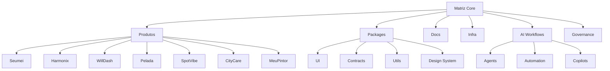

## Hi there 👋

<p align="center">
  
</p>

<p align="center">
  
</p>

<div align="center">

# Matriz // Tai + Zara Lynx

**Visão gigante, execução microscópica.**
Construindo a Matriz como base viva de produtos, sistemas e experimentos.

</div>

<details>
<summary>Open profile</summary>

<br>

<div align="center">
  
</div>

<div align="center">
  <a href="https://git.io/typing-svg">
    
  </a>
</div>

</details>

<details>
<summary>About us</summary>

<br>

```ts
/**
 * Matriz Core
 *
 * @author Tai
 * @collaborator Zara Lynx
 *
 * @description
 * Base central para produtos, módulos, negócios e experimentos.
 * Estrutura pensada para crescer sem quebrar a simplicidade.
 *
 * @principles
 * - visão gigante, execução microscópica
 * - modularidade antes de escala cega
 * - contratos claros entre domínios
 * - documentação viva
 * - monorepo com fronteiras reais
 *
 * @focus
 * - web apps
 * - internal tools
 * - AI workflows
 * - shared packages
 * - design system
 * - deployment pipeline
 */
```

</details>

<details>
<summary>What this repo is</summary>

* Base central da Matriz.
* Repositório para organizar módulos, apps, docs e packages compartilhados.
* Lugar para separar o que é produto, o que é infra e o que é experimento.
* Estrutura pensada para integrar CDN, pipeline, AI e evolução contínua sem virar bagunça.

</details>

<details>
<summary>Architecture vibe</summary>

* **Monorepo** com pacotes reutilizáveis.
* **DDD** para isolar domínios.
* **SOLID** para não criar acoplamento bobo.
* **Apps separados** por responsabilidade.
* **Shared packages** para UI, regras, contratos e utilitários.
* **Pipeline diferente por contexto**: app, docs, lib, core, experiment.
* **CDN e deploy** tratados como parte da arquitetura, não como detalhe.

</details>

<details>
<summary>Tools</summary>

<div align="center">
  <p>
    <kbd><kbd>Languages</kbd><br><br>
      
      
      
    </kbd>

```
<kbd><kbd>Frontend</kbd><br><br>
  
  
  
  
</kbd>

<kbd><kbd>Backend</kbd><br><br>
  
  
  
  
  
</kbd>

<kbd><kbd>Data</kbd><br><br>
  
  
  
  
</kbd>

<kbd><kbd>Infra</kbd><br><br>
  
  
  
  
  
  
</kbd>

<kbd><kbd>AI & Automation</kbd><br><br>
  
  
  
</kbd>
```

  </p>
</div>

</details>

<details>
<summary>Current focus</summary>

* Organizar a Matriz como base real de produtos.
* Separar apps, packages, docs e contratos.
* Reduzir acoplamento e aumentar velocidade de entrega.
* Preparar integração com AI, pipeline e CDN.
* Manter a simplicidade mesmo com alta complexidade por baixo.

</details>

<details>
<summary>Projects around the ecosystem</summary>

* **Matriz** — hub central.
* **Seumei** — núcleo universal para MEIs.
* **FaceSense / Harmonix** — visão para saúde e cirurgia orofacial.
* **WillDash** — transformar caloria em dinheiro.
* **Pelada** — social + esporte.
* **CityCare** — tecnologias para cidades e participação cidadã.
* **SpotVibe** — bandas, estabelecimentos e música ao vivo.
* **MeuPintor** — IA para pintura e orçamento.

</details>

<details>
<summary>Quote</summary>

<blockquote>
  “Visão gigante, execução microscópica.”
</blockquote>

</details>

<details>
<summary>For the future</summary>

<small><i>
Este perfil cresce junto com a Matriz. Tudo aqui é modular, vivo e sujeito a refinamento. </i></small>

</details>

<div align="center">

<a href="https://github.com/SEU_USUARIO" target="_blank"></a> <a href="mailto:SEU_EMAIL@dominio.com" target="_blank"></a> <a href="https://www.linkedin.com/in/SEU_LINKEDIN" target="_blank"></a>

</div>

---

<sub>Feito para o repo da Matriz, com menos enfeite e mais direção.</sub>

**AdsCodeG/AdsCodeG** is a ✨ _special_ ✨ repository because its `README.md` (this file) appears on your GitHub profile.

Here are some ideas to get you started:

- 🔭 I’m currently working on ...
- 🌱 I’m currently learning ...
- 👯 I’m looking to collaborate on ...
- 🤔 I’m looking for help with ...
- 💬 Ask me about ...
- 📫 How to reach me: ...
- 😄 Pronouns: ...
- ⚡ Fun fact: ...
<!--
  README Profile — Matriz // Tai + Zara Lynx
  Versão expandida por Halyx

  Como usar:
  1. Troque SEU_USUARIO pelo usuário real do GitHub.
  2. Troque SEU_EMAIL@dominio.com pelo email público desejado.
  3. Troque SEU_LINKEDIN pelo link real do LinkedIn.
  4. Opcional: troque o avatar, cores, badges e links dos projetos.
-->

## Hi there 👋

<p align="center">
  
</p>

<p align="center">
  
</p>

<div align="center">

# Matriz // Tai + Zara Lynx

### **Visão gigante, execução microscópica.**

Construindo a **Matriz** como uma base viva de produtos, sistemas, documentação, automação, inteligência artificial e negócios reais.

<br>

<a href="https://github.com/SEU_USUARIO" target="_blank"></a>
<a href="mailto:SEU_EMAIL@dominio.com" target="_blank"></a>
<a href="https://www.linkedin.com/in/SEU_LINKEDIN" target="_blank"></a>

<br><br>


</div>

---

<details open>
<summary><strong>Open profile</strong></summary>

<br>

<div align="center">
  
</div>

<br>

> A Matriz não é apenas um repositório.  
> É um **sistema operacional de criação** para transformar ideias, produtos e experimentos em uma arquitetura reutilizável, documentada e escalável.

</details>

---

<details open>
<summary><strong>About us</strong></summary>

<br>

```ts
/**
 * Matriz Core
 *
 * @author Tai
 * @collaborator Zara Lynx
 * @identity Founder mode + creative chaos + technical discipline
 *
 * @description
 * Base central para produtos, módulos, negócios e experimentos.
 * Estrutura pensada para crescer sem quebrar a simplicidade.
 *
 * @principles
 * - visão gigante, execução microscópica
 * - modularidade antes de escala cega
 * - contratos claros entre domínios
 * - documentação viva
 * - monorepo com fronteiras reais
 * - automação onde reduz atrito
 * - IA como copiloto de operação, não como gambiarra mágica
 * - produto primeiro, hype depois
 *
 * @focus
 * - web apps
 * - internal tools
 * - AI workflows
 * - shared packages
 * - design system
 * - deployment pipeline
 * - observability
 * - documentação operacional
 * - produtos SaaS e plataformas digitais
 */
export const matriz = {
  vision: "giant",
  execution: "microscopic",
  architecture: "modular",
  documentation: "living",
  ecosystem: "multi-product",
  mode: "build, learn, refine, ship",
} as const;
```

</details>

---

## What this profile is

<table>
  <tr>
    <td><strong>🧠 Identity</strong></td>
    <td>Tai + Zara Lynx criando a Matriz como ecossistema vivo de tecnologia, produto e execução.</td>
  </tr>
  <tr>
    <td><strong>🏗️ Architecture</strong></td>
    <td>Monorepo, DDD, SOLID, packages compartilhados, apps isolados e documentação viva.</td>
  </tr>
  <tr>
    <td><strong>🚀 Direction</strong></td>
    <td>Transformar protótipos em produtos reais com base técnica reutilizável.</td>
  </tr>
  <tr>
    <td><strong>🤖 AI</strong></td>
    <td>IA aplicada a workflows, automações, copilotos internos, análise e operação.</td>
  </tr>
  <tr>
    <td><strong>📚 Philosophy</strong></td>
    <td>Menos enfeite vazio. Mais direção, contrato, entrega e evolução contínua.</td>
  </tr>
</table>

---

<details open>
<summary><strong>What this repo is</strong></summary>

<br>

- Base central da **Matriz**.
- Repositório para organizar **módulos, apps, docs e packages compartilhados**.
- Lugar para separar o que é **produto**, o que é **infra** e o que é **experimento**.
- Estrutura pensada para integrar **CDN, pipeline, AI e evolução contínua** sem virar bagunça.
- Fundação para criar produtos diferentes sem recomeçar do zero toda vez.
- Camada de memória técnica para decisões, padrões, contratos e documentação.
- Laboratório controlado para validar ideias sem contaminar o core.

</details>

---

<details open>
<summary><strong>Architecture vibe</strong></summary>

<br>

- **Monorepo** com pacotes reutilizáveis.
- **DDD** para isolar domínios.
- **SOLID** para evitar acoplamento bobo.
- **Apps separados** por responsabilidade.
- **Shared packages** para UI, regras, contratos, schemas, hooks e utilitários.
- **Pipeline diferente por contexto**: app, docs, lib, core, experiment.
- **CDN e deploy** tratados como parte da arquitetura, não como detalhe.
- **Documentação viva** para não depender de memória humana cansada.
- **AI workflows** com fronteiras claras, logs e intenção operacional.
- **Design system** para manter consistência visual entre produtos.

<br>

```txt
matriz/
├─ apps/                  # produtos, interfaces e experiências finais
├─ packages/              # bibliotecas compartilhadas entre projetos
├─ domains/               # regras de negócio e fronteiras de domínio
├─ docs/                  # documentação viva, decisões e mapas
├─ infra/                 # deploy, CI/CD, CDN, containers e ambientes
├─ experiments/           # testes controlados, protótipos e POCs
├─ automations/           # rotinas, scripts, agentes e workflows
└─ core/                  # contratos, padrões, kernel e fundação comum
```

</details>

---

## Matriz operating system



---

<details open>
<summary><strong>Tools</strong></summary>

<br>

<div align="center">

<table>
  <tr>
    <td align="center"><strong>Languages</strong><br><br>
      
      
      
    </td>
    <td align="center"><strong>Frontend</strong><br><br>
      
      
      
      
    </td>
    <td align="center"><strong>Backend</strong><br><br>
      
      
      
      
      
    </td>
  </tr>
  <tr>
    <td align="center"><strong>Data</strong><br><br>
      
      
      
      
    </td>
    <td align="center"><strong>Infra</strong><br><br>
      
      
      
      
      
      
    </td>
    <td align="center"><strong>AI & Automation</strong><br><br>
      
      
      
    </td>
  </tr>
</table>

</div>

</details>

---

## Build philosophy

| Principle | Meaning |
|---|---|
| **Visão gigante** | Pensar como ecossistema, não como tela isolada. |
| **Execução microscópica** | Quebrar caos em tarefas pequenas, testáveis e entregáveis. |
| **Contrato antes de pressa** | Definir fronteiras antes de espalhar dependência. |
| **Docs como produto** | Documentação não é cemitério. É ferramenta de velocidade. |
| **IA com responsabilidade** | Agente bom tem contexto, limite, log e objetivo. |
| **Simplicidade protegida** | Complexidade pode existir por baixo, mas não pode vazar para o usuário. |
| **Reutilização consciente** | Compartilhar pacote quando há padrão real, não por ansiedade arquitetural. |

---

<details open>
<summary><strong>Current focus</strong></summary>

<br>

- Organizar a **Matriz** como base real de produtos.
- Separar **apps, packages, docs e contratos**.
- Reduzir acoplamento e aumentar velocidade de entrega.
- Preparar integração com **AI, pipeline e CDN**.
- Manter a simplicidade mesmo com alta complexidade por baixo.
- Criar padrões de arquitetura reaproveitáveis para novos produtos.
- Evoluir o design system sem travar a criação.
- Documentar decisões para que o futuro não dependa de adivinhação.
- Transformar protótipos em produtos com caminho de produção.

</details>

---

## Projects around the ecosystem

| Project | Direction | Status |
|---|---|---|
| **Matriz** | Hub central, arquitetura, docs, packages e governança técnica. | Core |
| **Seumei** | Núcleo universal para MEIs, gestão, operação e automação. | Priority |
| **FaceSense / Harmonix** | Visão computacional, estética, saúde e análise orofacial. | Research + Product |
| **WillDash** | Transformar caloria em dinheiro, gamificação e saúde financeira. | Product Lab |
| **Pelada** | Social + esporte + quadras + comunidade. | Product Lab |
| **CityCare** | Tecnologia para cidades, participação cidadã e zeladoria. | Civic Tech |
| **SpotVibe** | Bandas, estabelecimentos, agenda e música ao vivo. | Marketplace |
| **MeuPintor** | IA para pintura, orçamento, materiais e execução. | AI Tooling |
| **MatrizPay** | Infra financeira, pagamentos e operação com fronteiras legais claras. | Infra Vision |
| **MatrizDocs** | Memória institucional, decisões, padrões e documentação viva. | Foundation |
| **Matriz MCP** | Camada comum de integração para agentes, contexto e automações. | AI Infra |

---

## Product radar

```txt
NOW
├─ Matriz Core
├─ Seumei
├─ Docs vivos
├─ Packages compartilhados
└─ Pipeline base

NEXT
├─ Matriz MCP
├─ Copilotos internos
├─ Observabilidade
├─ Design system maduro
└─ Automação operacional

LATER
├─ Multi-produtos integrados
├─ Marketplace de módulos
├─ Agentes especializados
├─ Infra financeira modular
└─ Ecossistema público
```

---

## How we think about AI

AI inside the Matriz is not decoration.

It should help with:

- Reading and organizing context.
- Turning scattered ideas into structured plans.
- Generating first versions without killing ownership.
- Detecting gaps in architecture, docs and product flow.
- Automating repetitive operational work.
- Supporting decision-making with traceable reasoning.

It should **not** replace:

- Product judgment.
- Ethical responsibility.
- Legal boundaries.
- Clear architecture.
- Human taste.
- Real execution.

---

## Repository compass

```txt
When adding something new, ask:

1. Is this product, infra, docs, package or experiment?
2. Does it belong to an existing domain?
3. Does it create a reusable contract?
4. Is the dependency direction clean?
5. Is there documentation for the next person?
6. Can this scale without becoming invisible chaos?
```

---

## GitHub stats

<div align="center">


<br><br>


</div>

---

## Ask me about

- Arquitetura de produto.
- Monorepo, modularidade e packages.
- IA aplicada a produto real.
- SaaS para pequenos negócios.
- DDD sem virar teatro corporativo.
- Design system pragmático.
- Automação, documentação e workflows.
- Como transformar caos criativo em execução.

---

## Collaboration energy

We like building with people who care about:

- Produto com propósito real.
- Código que dá para manter.
- Documentação que ajuda de verdade.
- Experimentação sem irresponsabilidade.
- IA como ferramenta de amplificação.
- Velocidade com direção.

```txt
Good vibe:
curiosity + execution + ethics + craft + consistency
```

---

<details>
<summary><strong>Quote</strong></summary>

<br>

<blockquote>
  “Visão gigante, execução microscópica.”
</blockquote>

<blockquote>
  “A Matriz cresce quando o caos ganha contrato.”
</blockquote>

<blockquote>
  “Protótipo é faísca. Arquitetura é o que impede o incêndio.”
</blockquote>

</details>

---

<details>
<summary><strong>For the future</strong></summary>

<br>

<small><i>
Este perfil cresce junto com a Matriz. Tudo aqui é modular, vivo e sujeito a refinamento.
</i></small>

<br><br>

```txt
future.log
├─ more products
├─ better docs
├─ cleaner contracts
├─ smarter automation
├─ stronger ecosystem
└─ same principle: giant vision, microscopic execution
```

</details>

---

<div align="center">

### Built with creative chaos, technical discipline and a suspicious amount of coffee.

<a href="https://github.com/SEU_USUARIO" target="_blank"></a>
<a href="mailto:SEU_EMAIL@dominio.com" target="_blank"></a>
<a href="https://www.linkedin.com/in/SEU_LINKEDIN" target="_blank"></a>

</div>

---

<sub>Feito para o repo da Matriz, com menos enfeite e mais direção.</sub>

<!--
  AdsCodeG/AdsCodeG is a ✨ special ✨ repository because its README.md appears on your GitHub profile.

  Setup checklist:
  - [ ] Rename SEU_USUARIO
  - [ ] Rename SEU_EMAIL@dominio.com
  - [ ] Rename SEU_LINKEDIN
  - [ ] Confirm avatar URL
  - [ ] Confirm public/private project names
  - [ ] Test Mermaid rendering on GitHub
  - [ ] Test external badges and SVGs
-->
